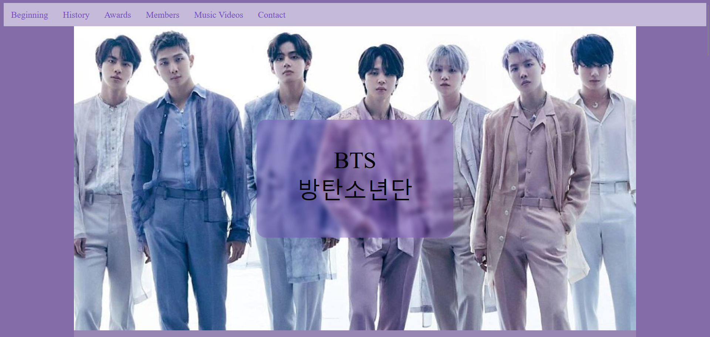
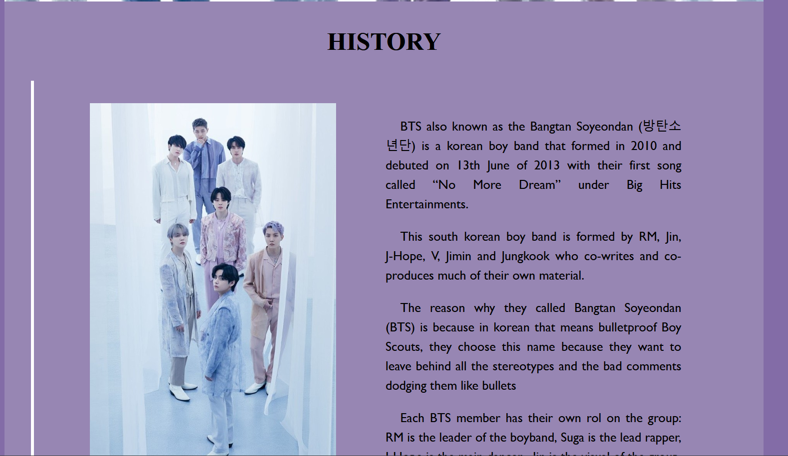
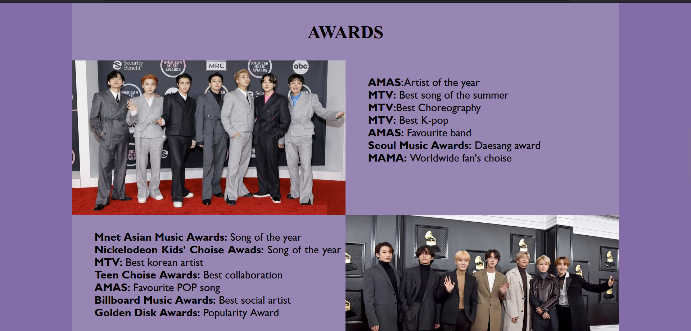
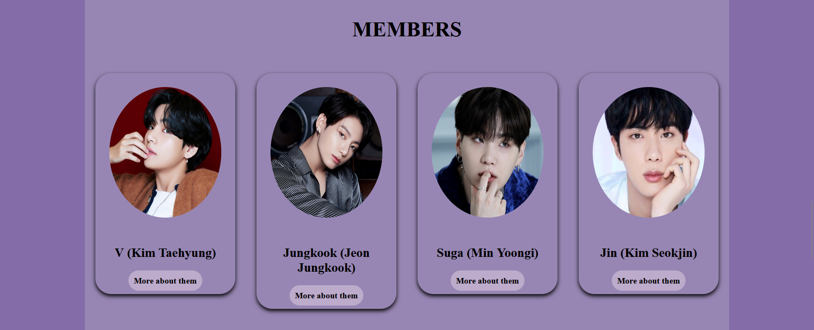
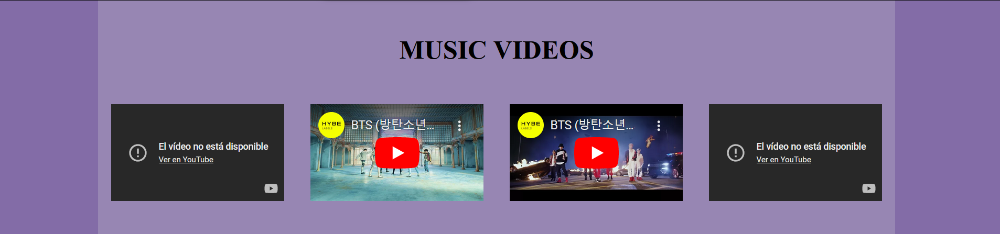
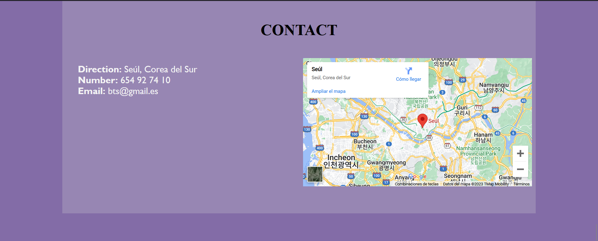
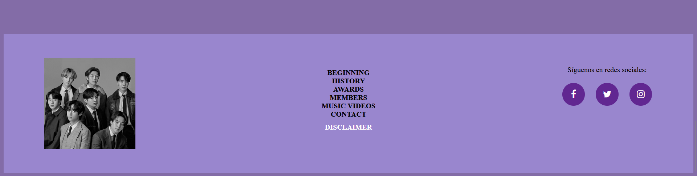
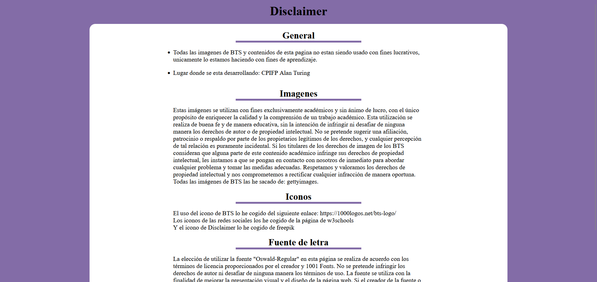

<h1>End of evaluation project report on Markup Languages - 1º DAM</h1>
<h2>BTS - A tribute site</h2>
<h2>Index</h2>
<ul>
  <li><a href="#introduccion">Introduction</a></li>
  <li><a href="#motivacion">Motivation</a></li>
  <li><a href="#estructura">Structure</a></li>
  <li><a href="#estilo">Style</a></li>
</ul>

<h2 id="introduccion">Introduction</h2>

Work done in class by: María Lucía López López

Web project "from scratch" of the 1st evaluation of Markup Languages.

Diciembre de 2023 

CC-BY License

<h2 id="motivacion">Motivation</h2>

I chose the theme because my cousin likes it and since I almost never give her things I wanted to make this about BTS for her, as I know it is a very special gift for her and I know she will always remember that moment.

<h2 id="estructura">Structure</h2>

The website is divided into 6 sections and the footer:

<ul>
  <li>Beggining</li>  
  <li>History</li>
  <li>Awards</li>
  <li>Members</li>
  <li>Music Videos</li>
  <li>Contact</li>
  <li>Footer</li>
  
</ul>

<h3>Beggining</h3>

I have used a background image taken from the gettyimages page that easily adapts to different devices such as mobiles, pc and tablets. 
On it I have placed a Call to Action that I have styled from w3schools, since we have used in class most of there and it was easier for me, since I had worked with them more than once and the ones I saw in w3schools had most of them much less text than the ones in other websites, so the less code there is the less chances you have to make a mistake. 

<h3>Hisory</h3>

I have arranged a grid of 2 columns in which the image and the explanatory text about the history of the BTS are divided.

<h3>Awards</h3>

I have a grid of 4 four columns, two with images and two with text.

<h3>Members</h3>

I have set up a grid with 4 columns of cards naming each of the members.

<h3>Music Videos</h3>

I have a grid with 4 columns and to add the videos I have used "iframe".

<h3>Contact</h3>

In this section I have arranged a grid with two columns, one to put the address, phone number and email. And in the other column where I have put the map of the exact location of the BTS.

<h3>Footer</h3>

In the footer I have added again the navigation bar so that when you get to the end you can select any option and it sends you back up to the section you want. I have also added the social networks and finally I have added below the navigation bar the disclaimer link.

<h3>Disclaimer</h3>

<h3>Script</h3>

And finally I have put the javascript link at the end of the code because otherwise the footer columns were not working properly.

<h2 id="estilo">Page style</h2>
<h3>Color palette</h3>

90% purple, 5%black, 5%white

<h3>Fonts</h3>

Oswald-regular

<h3>Images</h3>

Take from internet to match the color palett. The specific credits are on the website-

<h3>Videos</h3>

Four famous songs of the BTS

...................
<h2 id="snippets">Code snippets</h2>

I have used the following:

<ul>
  <li>Navigation bar: taken from w3Schools "How to" (poner vínculo)</li>
  <li>Accordion: I have taken it from the page freefrontend</li>
  <li>Credits button animation ande hero button animation: w3schools</li>
  <li>Javascript, parallax, grid gallery, overlay effect and Modal box: W3Schools</li>
  <li>The images and videos of BTS are of the official website</li>
  <li>The BTS icon is of the page 1000logos </li>
</ul>
